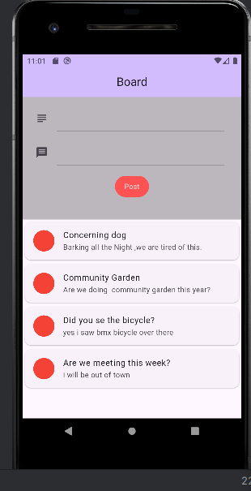
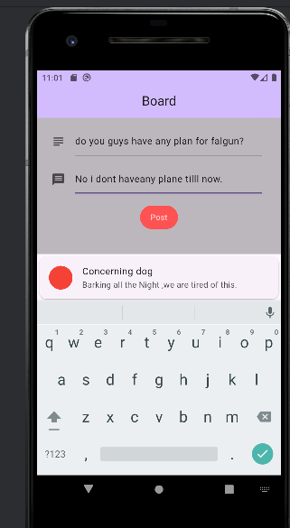
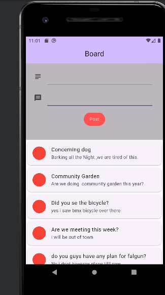
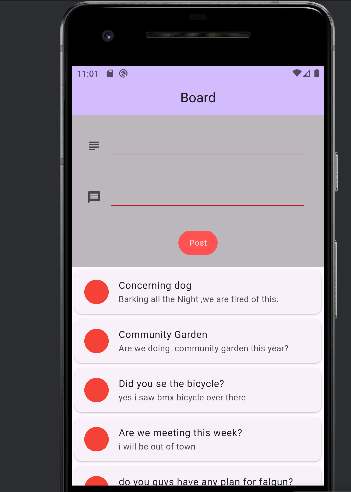
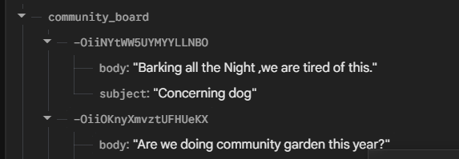

#  Community Board App (Flutter + Firebase)

A real-time community message board built using **Flutter** and **Firebase Realtime Database**.  
Users can post messages with a subject and body, and all messages appear instantly for everyone.

---

##  Features

- 📝 Post messages (Subject & Body)
- 🔄 Realtime updates using Firebase
- 📡 Live message feed
- 📱 Responsive Flutter UI
- ☁ Firebase cloud backend
- 🧠 Smart UI layout (no overflow issues)

---

##  Technologies Used

- Flutter
- Dart
- Firebase Realtime Database
- Firebase Core
- Firebase UI (`FirebaseAnimatedList`)

---

##  Screenshots

---

## Firebase Setup
- Create a Firebase project
- https://console.firebase.google.com
- Enable Realtime Database
-- Set test rules: **true**
- Add Android App in Firebase
- Download google-services.json
- Put it inside:  android/app/google-services.json

  ---

## Dependencies
- dependencies:
 -- flutter:
   - sdk: flutter
   - firebase_core: ^latest
   - firebase_database: ^latest
   - firebase_database/ui: ^latest
---

## Firebase Data Structure
- community_board
  - ├── -Nxa12
  - │     ├── subject: "Hello"
  - │     └── body: "This is my first post"
  - ├── -Nxa45
  - │     ├── subject: "Flutter"
  - │     └── body: "Realtime Firebase working!"
         
---
## How It Works
- Users submit a message using a form.
- Data is saved in Firebase Realtime Database.
- FirebaseAnimatedList listens to changes.
- Messages appear instantly without refresh.

---
## Author
**Abdul Aziz Patwary (Aziz)**  
Flutter Developer

